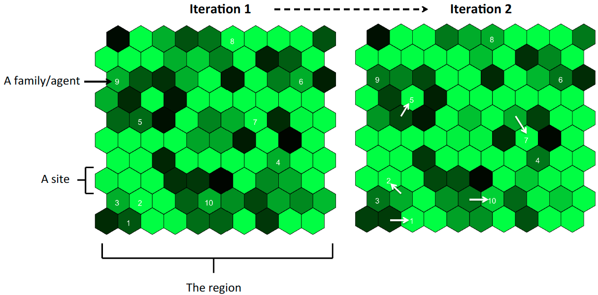
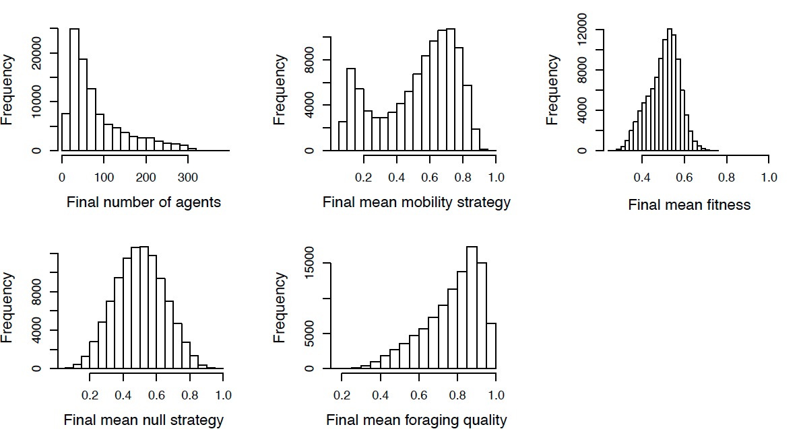

This project gives the C++ code describing an agent-based model for the origins of sedentism and agriculture. It also gives the analyse of the results from various runs of this model using R.

More details for the model and the analysis can be found in the READMEs in these folders.

## Model Overview

The Forager Model simulates families moving around a region over many years. The model is iterative and each iteration is one year. The region is split up into sites of the same size, and each of these sites has a dynamic foraging quality. Foraging quality can be thought of as the potential for foraging or, equally, the quality of the natural resources. Foraging resources stay within each site, and in this way do not include migrating animals. Family units (or ‘agents’) occupy one site each iteration (although many families can co-occupy a single site), and forage at this site. The family’s foraging creates a feedback between the foraging quality of the site and the family’s fitness. Families can die, fission, mutate, and move from site to site, according to different probabilities.

The Forager-Farmer Model builds on the Forager Model by allowing agents to have a strategy which makes them more of less depending on farming.

## Analysis Overview

We plot various descriptions of different runs of the model and also perform some cluster analysis to look at different types of simulation.

## Thesis

My thesis describes the context to the modelling approaches and decisions (Chapter 2), the model (Chapter 4 and Chapter 6.1), and the analysis of the model results (Chapters 5 and 6) in full.

## Projects

Using different parameters and settings the model was ran to generate data for three different projects:

1. The fast and the fit (link to follow)
2. The Forager Model (Chapter 5 of my thesis)
3. The Forager-Farmer Model (Chapter 6 of my thesis)

There are data folders and analysis folders for each of these. Model settings can be found in the papers and PhD chapters for each.

## Data

Please message me on Github or [download the data](https://figshare.com/account/home#/projects/58973) directly from figshare.

## Contributions

I designed the models and the analysis of them with [Mark Thomas](https://www.ucl.ac.uk/mace-lab/people/mark) and [Stephen Shennan](https://www.ucl.ac.uk/archaeology/people/academic/stephen-shennan) from UCL.

